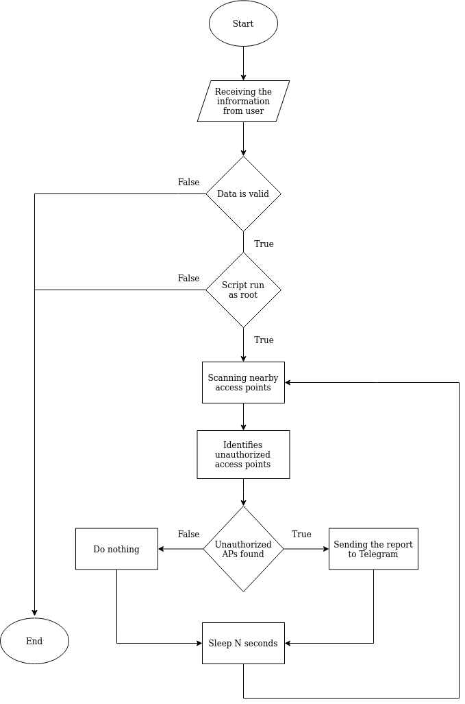

## :telescope: About
`Wireless Access Point Scanner` - scans and identifies unknown/unauthorized access points using a whitelist of authorized access points, then sends a report to Telegram (MAC, SIGNAL, SSID)


The main limitation for the project is that the script must work on routers with OpenWRT without using external libraries. 

### Flowchart of the script


## :gear: Installation
1. Install the tools
    + Debian: `apt-get install iw curl python3`
    + OpenWRT: `opkg install iw curl python3-light`
2. Clone the repository
    + `git clone https://github.com/curvtd/waps.git`

## :book: Usage
```
usage: waps.py -n NAME -i -INT -s SEC -a API -u ID

Keep an eye out for unauthorized access points

Required arguments (except "help"):
  -h, --help            show this help message and exit
  -n NAME, --name NAME  Name for the device
  -i INT, --int INT     Network interface for scan
  -s SEC, --sec SEC     Time period between reports
  -a API, --api API     Telegram Bot API token
  -u ID, --user ID      User/Chat ID
```

Don't forget to write MAC addresses of allowed access points in the whitelist.txt (one address per line). 
Example of whitelist.txt:
```
AA:AA:AA:AA:AA:AA
BB:BB:BB:BB:BB:BB
```


